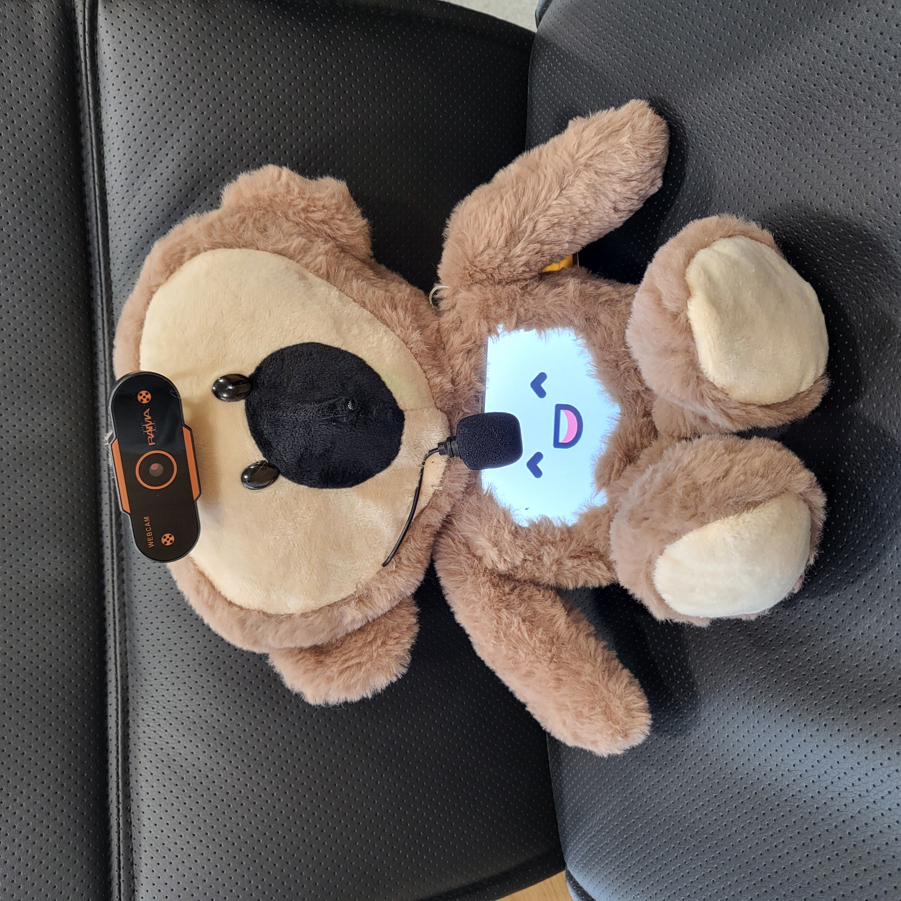
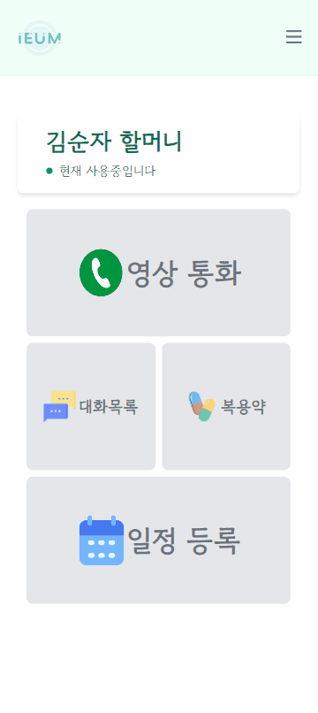
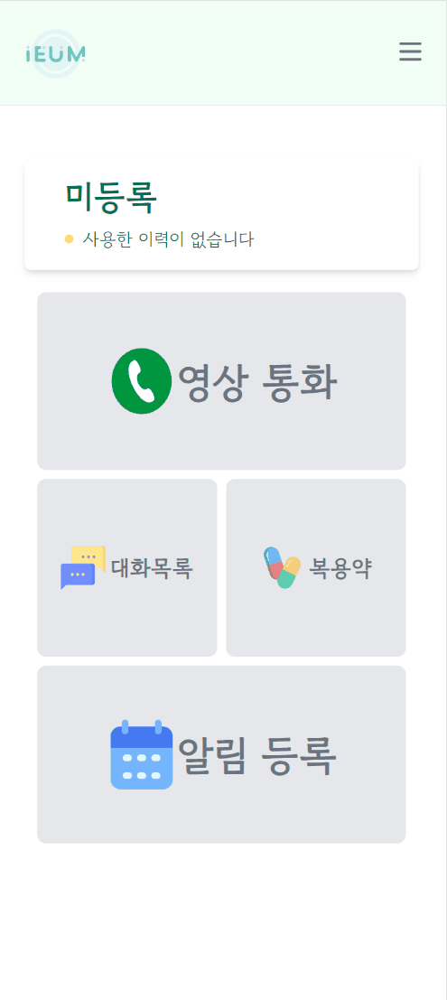
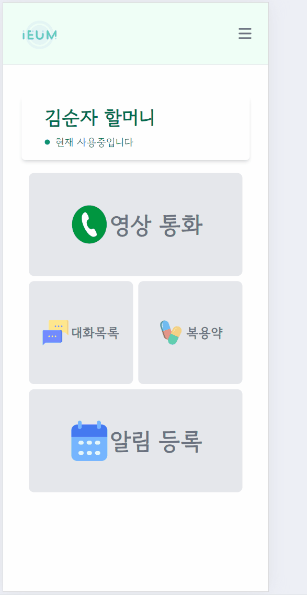
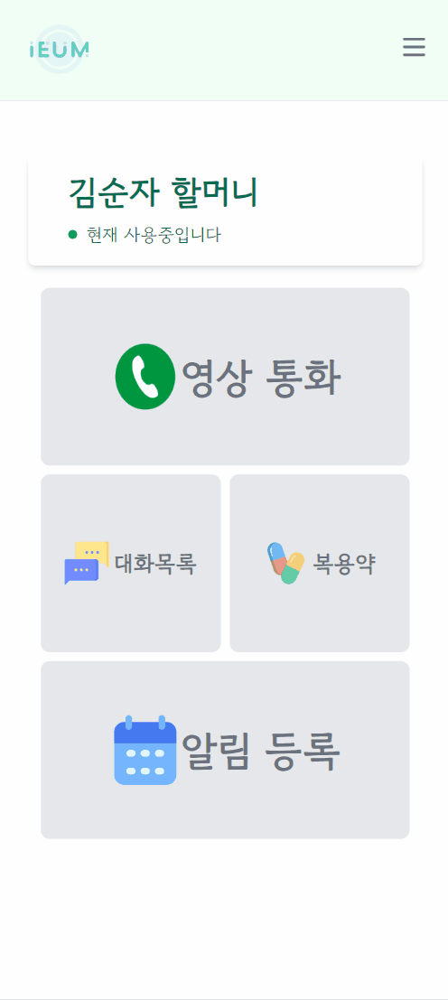
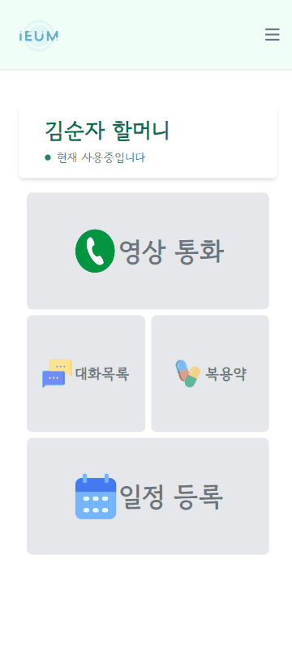

#  IEUM

독거노인을 위한 인공지능 스피커 "이음"
<br>

## 👩‍👩‍👧‍👦 팀원 소개

<div align="center">

|                                                                                    **김영욱-팀장**<br>BE, IOT                                                                                     |                                                                                        **강다솔-팀원**<br>BE, FE                                                                                        |                                                                                      **서다찬-팀원**<br>BE, FE                                                                                       |                                                                                        **이성목-팀원**<br>BE, IOT                                                                                        |                                                                                           **우혁-팀원**<br>FE                                                                                            |                                                                                          **장태수-팀원**<br>FE                                                                                          |
| :-----------------------------------------------------------------------------------------------------------------------------------------------------------------------------------------------: | :-----------------------------------------------------------------------------------------------------------------------------------------------------------------------------------------------------: | :--------------------------------------------------------------------------------------------------------------------------------------------------------------------------------------------------: | :------------------------------------------------------------------------------------------------------------------------------------------------------------------------------------------------------: | :------------------------------------------------------------------------------------------------------------------------------------------------------------------------------------------------------: | :-----------------------------------------------------------------------------------------------------------------------------------------------------------------------------------------------------: |
| [ <br/> @dmnion](https://lab.ssafy.com/dmnion) | [ <br/> @dasol199](https://lab.ssafy.com/dasol199) | [ <br/> @chn7894](https://lab.ssafy.com/chn7894) | [ <br/> @CocoisCat](https://lab.ssafy.com/CocoisCat) | [ <br/> @dngur12kr](https://lab.ssafy.com/dngur12kr) | [ <br/> @use02042](https://lab.ssafy.com/use02042) |

</div>

## 목차

<hr>

1. 프로젝트 개요

2. 소개

3. 기능

4. 배포 방법

<br>

## 📝 프로젝트 개요

- <strong>진행 기간</strong>: 2024.01.03 ~ 2024.02.16
- <strong>목표</strong>
  - 독거노인과 이음이가 상호 소통함으로써 독거노인의 외로움을 덜어줄 수 있다
  - 리마인드 기능을 통해 독거노인의 식사, 일정, 약 복용, 취침 등 일상 생활에 도움을 줄 수 있다
  - 영상 통화를 기능을 통해 독거노인과 소통할 수 있다
  - 보호자는 웹 서비스를 통해 독거노인의 활동 상태를 모니터링 할 수 있다
    <br>

## ✍️ 프로젝트 소개

<strong>IEUM</strong>은 독거노인을 위한 AI 스피커입니다.

이음이는 대화형 인공지능을 탑재하여 독거노인의 말동무가 되어줄 수 있습니다.<br>
관리자가 이음이의 최근 사용 내역을 통해 독거노인의 상태를 모니터링할 수 있습니다.

이음이는 식사 알림, 일정 알림, 기념일 알림, 취침 알림, 약 복용 알림 등의 기능을 탑재하여 독거노인의 일상생활에 도움을 줄 수 있습니다.<br>

<strong>IEUM</strong>을 통해 독거노인의 생활에 도움을 주고자 합니다.

<br>

## 💡 주요 기능

<br>

## ChatGPT 기반의 대화형 인공지능 탑재

> ChatGPT 기반의 10살 지능을 가진 대화형 인공지능을 활용하여 독거노인의 말동무가 되어줄 수 있습니다



- 여러가지 대화가 가능하며, 상호작용합니다.

<br></br>

### 1. 알람 등록 및 알림 발생

> 정해진 시각에 알림을 설정하여 알람에 따라 다른 음성을 출력합니다.
> <br>

1. 기념일 등록



<br><br/>

2. 보호자정보등록



<br><br/>

3. 보호자정보수정


<br><br/>

4. 투약 등록



<br><br/>

5. 식사시간 등록



<br><br/>

6. 일정 등록



<br><br/>

### 2. 독거노인의 상태 모니터링

- 화재 시 사이렌 소리를 출력합니다.
- 수면 시간 설정 시 이음이의 효율적인 관리를 위해 이음이가 동작이 종료됩니다.
- 장시간 이음이와 사용자가 교류가 없을 시(3일 이상), 관리자 페이지에서 교류가 없음을 알립니다.

<br><br/>

### 3. WebRTC를 활용한 영상통화

> 1대 1로 사용자와 영상 통화를 수행합니다.


<br>

## ⚙️ 기술 스택

## 📺 개발환경

- FE
  <div>
   <br/>
  <br/>
  <br/>
  <br/>
  </div>

<br>

- BE
  <div>
    <br>
    <br>
    <br>
    <br>
  </div>

- IoT

  <div>
    <br>
    <br>
    <br>
  </div>

- 영상통화

  - openvidu

- API

  <div>
    <br>
    <br>
    <br>
  </div>

- 배포
  <div>
    <br>
    <br>
    <br>
  </div>

<br>

## 🏑 conventionss

### commit message convention

- init : 프로젝트 초기 설정
- feat: 새로운 기능 추가
- chore : 빌드 관련 파일, 패키지 매니저 수정 (.gitignore or build.gradle) - 프로덕션 코드 변경 x, 예외 처리 추가
- add: feat 이외의 코드 or 라이브러리 or 파일 추가
- style: 스타일 관련 기능 (오타 수정, 변수명 변경, 코드 포맷팅, 세미콜론 누락, 코드 자체에는 변경이 없는 경우)
- conf : 환경 설정(properties, yml)
- fix: 버그 수정
- refactor : 코드 리팩토링
- comment : 주석 추가 및 변경
- perf: 성능 개선
- ci: CI/CD 설정 변경
- docs: 문서 수정(README.md 수정)
- design: CSS 등 사용자 UI 디자인 변경
- test : 테스트 코드, 리펙토링 테스트 코드 추가
- !HOTFIX: 급하게 치명적인 버그를 고쳐야하는 경우
- rename: 파일 혹은 폴더명을 수정하거나 옮기는 작업만인 경우
- remove: 파일을 삭제하는 작업만 한 경우

### git branch convention

- Git-Flow 사용
- master - develop - feature
- 개인 개발한 것들은 모두 feature/기능 브랜치에서 수행
- 프론트와 백에서 asignee로 지명된 이들이 심사후 develop으로 merge

<br>

## 🌐 배포 방법

### 1. Front End  

nginx path : /  
Vue.js 배포

  ```
  npm install
  ```

  - 필요한 패키지에 대한 install 을 실행합니다.

  ```
  npm run build
  ```

  - 빌드 결과로 나온 dist 폴더를 Ec2서버의 /var/www/frontend 디렉토리에 옮겨줍니다.


<br></br>

### 2. Back End  

- application.yml
```
logging:
  level:
    org.springframework.web.client: debug
    org.hibernate.sql: debug
    org.hibernate.type: trace
    org.springframework.security: debug

server:
  servlet:
    encoding:
      charset: UTF-8
      force: true


spring:
  profiles:
    default: dev
```

- application-dev.yml
```
openai:
  model: gpt-4
  secret-key: 

naver-cloud-sms:
  accessKey: 
  secretKey: 
  serviceId: 
  senderPhone: 

naver-cloud-stt:
  secret: 
  id: 

cloud:
  aws:
    s3:
      bucket: 
    stack.auto: false
    region.static: 
    credentials:
      accessKey: 
      secretKey: 

spring:
  jpa:
    database-platform: org.hibernate.dialect.MySQL8Dialect
    hibernate:
      ddl-auto: none
    properties:
      hibernate:
        auto_quote_keyword: true
        format_sql: true
        show_sql: true
      defer-datasource-initialization: true
      sql:
        init:
          mode: always

  servlet:
    multipart:
      max-file-size: 10MB
      max-request-size: 20MB

  datasource:
    driver-class-name: com.mysql.cj.jdbc.Driver
    url: 
    username: 
    password: 

    # 커넥션 풀
    hikari:
      maximum-pool-size: 10
      connection-timeout: 5000
      connection-init-sql: SELECT 1
      validation-timeout: 2000
      minimum-idle: 10
      idle-timeout: 600000
      max-lifetime: 1800000
  data:
    redis:
      host: 
      port: 
      host2: 
      port2: 

# jwt
jwt:
  secret-key: 
  expiration: 86400000
  refresh:
    expiration: 604800000

server:
  ssl:
    enabled: true
    key-store: 
    key-store-type: PKCS12
    key-alias: 
    key-store-password: 
  port: 443


openvidu:
  url: https://i10a303.p.ssafy.io:4443/
  secret: MY_SECRET
```


<div>
  Spring Boot 배포

    - ./gradlew.bat -x test build

    - java -jar ieum.0.0.1.jar
</div>

<br></br>

### 3. OpenVidu  

<div>
  EC2 설정

  ```
  sudo su

  ```

  ```
  cd /opt

  ```

  `curl https://s3-eu-west-1.amazonaws.com/aws.openvidu.io/install_openvidu_latest.sh | bash`

  - 위 명령어들로 전체 이미지를 다운 받기

  - port 열어주기 → 기본적으로 Openvidu가 사용하는 포트 목록

  ```
  ufw allow ssh
  ufw allow 80/tcp
  ufw allow 443/tcp
  ufw allow 3478/tcp
  ufw allow 3478/udp
  ufw allow 40000:57000/tcp
  ufw allow 40000:57000/udp
  ufw allow 57001:65535/tcp
  ufw allow 57001:65535/udp
  ufw enable
  ```

  - .env 수정

  ```
  DOMAIN_OR_PUBLIC_IP=i10a303.p.ssafy.io

  HTTPS_PORT=4443
  ```

  - 실행

  ```
  ./openvidu
  ```

  ```
  server{

      listen 443 ssl;

      server_name i10a303.p.ssafy.io;


      ssl_certificate "/etc/letsencrypt/live/i10a303.p.ssafy.io/fullchain.pem";
      ssl_certificate_key "/etc/letsencrypt/live/i10a303.p.ssafy.io/privkey.pem";


      location /openvidu{
          rewrite ^/openvidu(.*)$ $1 break;
              proxy_pass https://i10a303.p.ssafy.io:4443;
              proxy_http_version 1.1;
              proxy_set_header Host $host;

              proxy_set_header Upgrade $http_upgrade;
              proxy_set_header Connection "upgrade";
              proxy_read_timeout 86400;
      }


      location /api{
          proxy_pass https://localhost:8080;
          proxy_set_header Host $host;
      }


      location /images{
          root /home/ubuntu;
          #try_files $uri.png $uri.jpg $uri.jpeg =404;
      }

      location / {

          root        /var/www/front;
          index       index.html index.htm;
          try_files $uri $uri/ /index.html;
      }

  ```
</div>

<br></br>


### 4. Django  

<br>

프로젝트 폴더 이동

<br>

# virtualenv 설치
sudo apt install virtualenv

<br>

# 가상환경 생성
virtualenv venv

<br>

# 가상환경 실행
source venv/bin/activate

<br>

# 라이브러리 설치
pip install -r requirements.txt

<br>

# 장고 서버 실행
python manage.py runserver --noreload

<br>

# 가상환경 종료
deactivate

<br></br>


### 첫 배포시 주의 사항

첫 배포시에는 [init-letsencrypt.sh](./init-letsencrypt.sh)을 실행시켜 certbot에 의해 SSL/TLS 인증서를 생성하도록 해야 합니다.

init-letsencrypt.sh 내용에서 `domains`와 `data_path`, `email`을 알맞게 수정한 뒤 실행시키면 됩니다.

### 배포시 주의 사항

redis/redis-data와 mysql/mysql-data는 각각 redis container와 mysql(mariadb) container의 데이터 저장 directory를 mount하고 있으니 각별히 주의해야 합니다.
