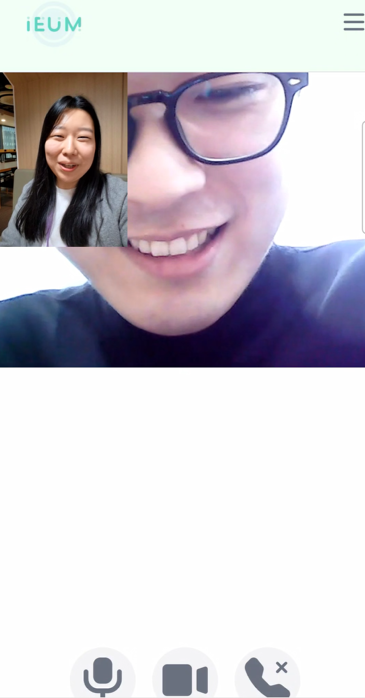

#  IEUM

독거노인을 위한 인공지능 스피커 "이음"
<br>

## 👩‍👩‍👧‍👦 팀원 소개

<div align="center">

|                                                                                    **김영욱-팀장**<br>BE, IOT                                                                                     |                                                                                        **강다솔-팀원**<br>BE, FE                                                                                        |                                                                                      **서다찬-팀원**<br>BE, FE                                                                                       |                                                                                        **이성목-팀원**<br>BE, IOT                                                                                        |                                                                                           **우혁-팀원**<br>FE                                                                                            |                                                                                          **장태수-팀원**<br>FE                                                                                          |
| :-----------------------------------------------------------------------------------------------------------------------------------------------------------------------------------------------: | :-----------------------------------------------------------------------------------------------------------------------------------------------------------------------------------------------------: | :--------------------------------------------------------------------------------------------------------------------------------------------------------------------------------------------------: | :------------------------------------------------------------------------------------------------------------------------------------------------------------------------------------------------------: | :------------------------------------------------------------------------------------------------------------------------------------------------------------------------------------------------------: | :-----------------------------------------------------------------------------------------------------------------------------------------------------------------------------------------------------: |
| [ <br/> @dmnion](https://lab.ssafy.com/dmnion) | [ <br/> @dasol199](https://lab.ssafy.com/dasol199) | [ <br/> @chn7894](https://lab.ssafy.com/chn7894) | [ <br/> @CocoisCat](https://lab.ssafy.com/CocoisCat) | [ <br/> @dngur12kr](https://lab.ssafy.com/dngur12kr) | [ <br/> @use02042](https://lab.ssafy.com/use02042) |

</div>

## 목차

<hr>

1. 프로젝트 개요

2. 소개

3. 기능

4. 배포 방법

<br>

## 📝 프로젝트 개요

- <strong>진행 기간</strong>: 2024.01.03 ~ 2024.02.16
- <strong>목표</strong>
  - 독거노인과 이음이가 상호 소통함으로써 독거노인의 외로움을 덜어줄 수 있다
  - 리마인드 기능을 통해 독거노인의 식사, 일정, 약 복용, 취침 등 일상 생활에 도움을 줄 수 있다
  - 영상 통화를 기능을 통해 독거노인과 소통할 수 있다
  - 보호자는 웹 서비스를 통해 독거노인의 활동 상태를 모니터링 할 수 있다
    <br>

## ✍️ 프로젝트 소개

<strong>IEUM</strong>은 독거노인을 위한 AI 스피커입니다.

이음이는 대화형 인공지능을 탑재하여 독거노인의 말동무가 되어줄 수 있습니다.<br>
관리자가 이음이의 최근 사용 내역을 통해 독거노인의 상태를 모니터링할 수 있습니다.

이음이는 식사 알림, 일정 알림, 기념일 알림, 취침 알림, 약 복용 알림 등의 기능을 탑재하여 독거노인의 일상생활에 도움을 줄 수 있습니다.<br>

<strong>IEUM</strong>을 통해 독거노인의 생활에 도움을 주고자 합니다.

<br>

## 💡 주요 기능

<br>

## ChatGPT 기반의 대화형 인공지능 탑재

> ChatGPT 기반의 10살 지능을 가진 대화형 인공지능을 활용하여 독거노인의 말동무가 되어줄 수 있습니다


- 여러가지 대화가 가능하며, 상호작용합니다.

<br></br>

### 1. 알람 등록 및 알림 발생

> 정해진 시각에 알림을 설정하여 알람에 따라 다른 음성을 출력합니다.
> <br>

1. 기념일 등록


<br><br/>

2. 보호자정보등록


<br><br/>

3. 보호자정보수정


<br><br/>

4. 투약 등록


<br><br/>

5. 식사시간 등록


<br><br/>

6. 일정 등록


<br><br/>

### 2. 독거노인의 상태 모니터링

- 화재 시 사이렌 소리를 출력합니다.
- 수면 시간 설정 시 이음이의 효율적인 관리를 위해 이음이가 동작이 종료됩니다.
- 장시간 이음이와 사용자가 교류가 없을 시(3일 이상), 관리자 페이지에서 교류가 없음을 알립니다.

<br><br/>

### 3. WebRTC를 활용한 영상통화

> 1대 1로 사용자와 영상 통화를 수행합니다.



<br>

## ⚙️ 기술 스택

## 📺 개발환경

- FE
  <div>
   <br/>
  <br/>
  <br/>
  <br/>
  </div>

<br>

- BE
  <div>
    <br>
    <br>
    <br>
    <br>
  </div>

- IoT

  <div>
    <br>
    <br>
    <br>
  </div>

- 영상통화

  - openvidu

- API

  <div>
    <br>
    <br>
    <br>
  </div>

- 배포
  <div>
    <br>
    <br>
    <br>
  </div>

<br>

## 🏑 conventionss

### commit message convention

- init : 프로젝트 초기 설정
- feat: 새로운 기능 추가
- chore : 빌드 관련 파일, 패키지 매니저 수정 (.gitignore or build.gradle) - 프로덕션 코드 변경 x, 예외 처리 추가
- add: feat 이외의 코드 or 라이브러리 or 파일 추가
- style: 스타일 관련 기능 (오타 수정, 변수명 변경, 코드 포맷팅, 세미콜론 누락, 코드 자체에는 변경이 없는 경우)
- conf : 환경 설정(properties, yml)
- fix: 버그 수정
- refactor : 코드 리팩토링
- comment : 주석 추가 및 변경
- perf: 성능 개선
- ci: CI/CD 설정 변경
- docs: 문서 수정(README.md 수정)
- design: CSS 등 사용자 UI 디자인 변경
- test : 테스트 코드, 리펙토링 테스트 코드 추가
- !HOTFIX: 급하게 치명적인 버그를 고쳐야하는 경우
- rename: 파일 혹은 폴더명을 수정하거나 옮기는 작업만인 경우
- remove: 파일을 삭제하는 작업만 한 경우

### git branch convention

- Git-Flow 사용
- master - develop - feature
- 개인 개발한 것들은 모두 feature/기능 브랜치에서 수행
- 프론트와 백에서 asignee로 지명된 이들이 심사후 develop으로 merge

<br>

## 🌐 배포 방법

[frontend/src/constant/prod.js](./frontend/src/constant/prod.js)에서 올바른 도메인 이름으로 변경합니다.

WebRTC를 사용하기 때문에 STUN/TURN 서버가 필요합니다.

오픈 소스 프로젝트인 [coturn](https://github.com/coturn/coturn)을 설치하는 방법은 다음과 같습니다

```sh
sudo apt-get update && sudo apt-get install --no-install-recommends --yes coturn
```

`/etc/default/coturn`의 내용을 다음과 같이 수정합니다.

```sh
TURNSERVER_ENABLED=1
```

`/etc/turnserver.conf`의 내용을 다음과 같이 수정합니다.

```sh
listening-port=3478
tls-listening-port=5349
listening-ip=<EC2의 프라이빗 IPv4 주소>
external-ip=<EC2의 퍼블릭 IPv4 주소>/<EC2의 프라이빗 IPv4 주소>
relay-ip=<EC2의 프라이빗 IPv4 주소>
fingerprint
lt-cred-mech
user=myuser:mypassword
realm=myrealm
log-file=/var/log/turn.log
simple-log
```

coturn을 재기동합니다.

```
sudo service coturn restart
```

다음 명령어를 통해 coturn의 상태를 확인할 수 있습니다.

```
sudo systemctl status coturn
```

배포를 하기 위해서는 서버에 docker와 docker-compose가 설치되어 있어야 합니다.  
docker는 [공식 웹페이지에 나와 있는 debian에서의 설치 방법](https://docs.docker.com/engine/install/debian/#install-using-the-repository)으로 설치하면 되고, docker-compose는 apt-get 명령어를 통해 설치가 가능합니다.

프로젝트의 root 위치에서 docker-compose를 실행하면 빌드 및 배포까지 자동으로 이루어집니다.

```sh
docker-compose up -d
```

단, docker-compose를 실행하기 위해서는 `prod.env` 파일이 필요합니다. `prod.env`의 내용은 다음과 같습니다.

```env
# backend
GOOGLE_CLIENT_ID=1q2w3e4r-1q2w3e4r.apps.googleusercontent.com
GOOGLE_CLIENT_SECRET=4r3e2w1q4r3e2w1q
SPRING_DATASOURCE_USERNAME=a104
SPRING_DATASOURCE_PASSWORD=a1041234
JWT_SECRET=1q2w3e4r
#OPENVIDU_URL=https://<service domain name>:3333/
OPENVIDU_URL=https://openvidu:3333/
APP_BASE_URL=https://<service domain name>

# openvidu
KMS_STUN_IP=<coturn server ip>
KMS_STUN_PORT=3478
KMS_TURN_URL=myuser:mypassword@<coturn server ip>:3478?transport=udp
DOMAIN_OR_PUBLIC_IP=<service domain name>

# backend & openvidu
OPENVIDU_SECRET=MY_SECRET

# mysql
MYSQL_USER=a104
MYSQL_PASSWORD=a1041234
MYSQL_ROOT_PASSWORD=a1041234
```

### 첫 배포시 주의 사항

첫 배포시에는 [init-letsencrypt.sh](./init-letsencrypt.sh)을 실행시켜 certbot에 의해 SSL/TLS 인증서를 생성하도록 해야 합니다.

init-letsencrypt.sh 내용에서 `domains`와 `data_path`, `email`을 알맞게 수정한 뒤 실행시키면 됩니다.

### 배포시 주의 사항

redis/redis-data와 mysql/mysql-data는 각각 redis container와 mysql(mariadb) container의 데이터 저장 directory를 mount하고 있으니 각별히 주의해야 합니다.
