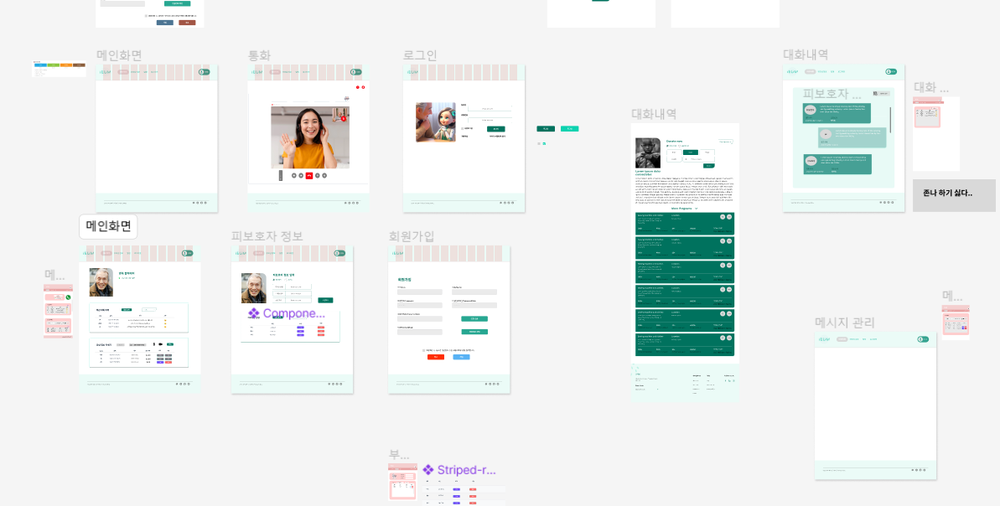

 
 

## 아침 스크럼 회의
- 당일 라이브에서 프로토타입의 예시를 시청한 이후 figma의 보완이 필요하다고 느껴져 기능명세서와 기존의 프로토타입을 기반으로 전면 재작성
- 기존 react 활용 예정에서 시간 부족으로 vue3로 전환

 

## figma 보완

> figma 기본 템플릿을 기반으로 각종 화면의 프로토타입을 여러 팀원들과 같이 제작.  
> 백엔드 팀원들이 작성한 API 명세서에 대한 회의를 진행함

 

## 저녁 스크럼 회의

**태수**- 피그마가 굉장히 어려운 작업이라는 것을 깨달았다. 내일 UI 마무리하고 vue3 기능 구현에 힘쓰겠다.

**우혁**- 오늘 git 커밋 이쁘게 올리기, vue3 라우팅 등을 학습했다. 팀원들이 친절히 알려줘서 빠른 이해가 된 것 같다. 내일 UI 같이 마무리하고, 미리미리 기능 구현에 힘쓰겠다.

**다솔**- api명세서 보완, 프로젝트 구조 생성을 진행했다.  내일 젠킨스 학습할 예정이다.

**영욱**- 내일 뭐할지 모르겠다. api 명세서 보완하고 라즈베리파이를 가지고 놀겠다.

**다찬**- 내일 라즈베리파이 관련하여 학습을 진행하겠다.  앞으로도 좋은 분위기가 조성됐으면 좋겠다.

**성목**- 내일 오전 중, git강의를 할 예정이다. 잘 따라오길 바란다.