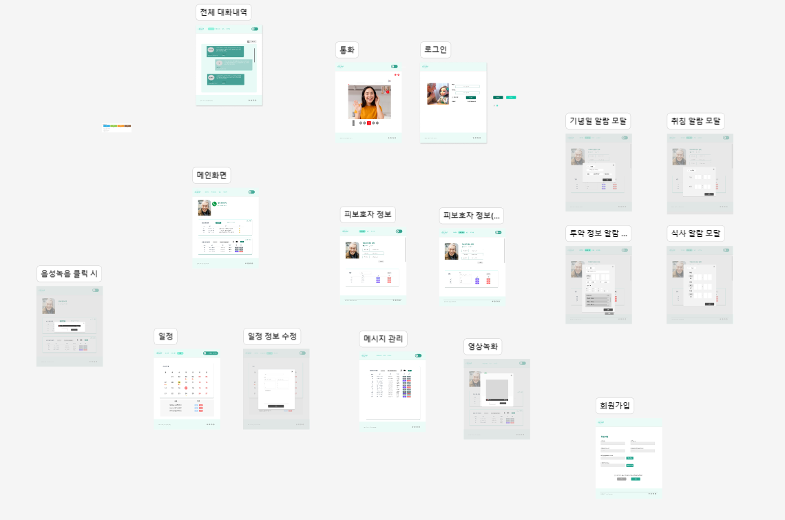

 
 

## 아침 스크럼 회의
- 당일 라이브에서 프로토타입의 예시를 시청한 이후 figma의 보완이 필요하다고 느껴져 기능명세서와 기존의 프로토타입을 기반으로 전면 재작성
- 기존 react 활용 예정에서 시간 부족으로 vue3로 전환
- 당일 vue3 header footer 기본 구조 제작

 

## figma 보완

> figma 기본 템플릿을 기반으로 각종 화면의 프로토타입을 보완.

 