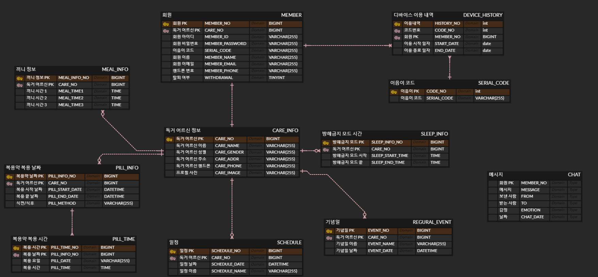

### PJT-2
#### 2024-01-16

- [x] ERD
- [x] API 명세서
- [x] 컨설턴트님 미팅

 

#### ERD

ERD (Entity Relationship Diagram)는 단어에서 의미하는 그대로 'Entity 개체'와 'Relationship 관계'를 중점적으로 표시하는 데이터베이스 구조를 한 눈에 알아보기 위해 그려놓는 다이어그램

 

 

 [FEEDBACK]
  - 이음이가 반드시 1:1이어야하는가? (PK다른 여러 1:1 테이블 나중에 큰 허들 된다!)
  - 1:1로 할 것이라면 아예 테이블을 합치는 것이 데이터 관리에 유리
 &nbsp;&nbsp; → 확장성을 고려한다면 분리하는 것이 맞다.
 &nbsp;&nbsp; → 로직은 1:1이더라도 데이터베이스는 1:N으로 저장 (히스토리 관리)
  - 이음이를 다른 회원에게 넘기려면 히스토리 관리 테이블이 존재해야 한다.
  - IoT 마스터 테이블이 따로 존재해야 한다.
 &nbsp;&nbsp; → **회원 테이블과 연결하지 않고 IoT 코드값을 참조값으로 활용한다.**
 &nbsp;&nbsp; → 이음이 코드 주인만 뽑을 수 있도록 강력한 방어 로직이 필요하다.
  - 이음이 코드 연결 끊고 히스토리 관리 로직 추가!!

 

#### API 명세서

[API 명세서](https://documenter.getpostman.com/view/14490463/2s9YsNfBM4)

 

 [FEEDBACK]
  - 핸드폰 번호 body로 보내는 것 추천한다. (보안!!!)
  - API는 프론트엔드와 단위와 응답이 충분한지 확인받아야한다.
  - **Status는 코드화하여 공통적으로 통일하는 것이 좋다.**
 &nbsp;&nbsp; → 응답 코드가 너무 친절할 필요는 없다. 
 &nbsp;&nbsp; → 너무 친절한 응답은 오히려 보안에 불리하다!
  - 공통 Controller로 공통 응답을 내리도록 하는 것이 좋다.
 
