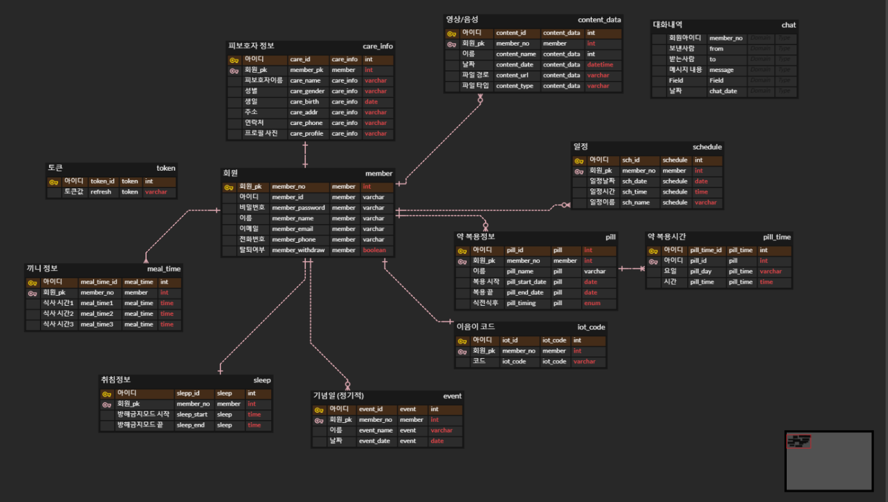
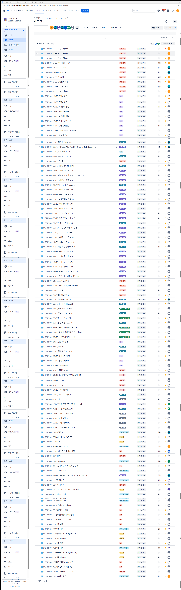
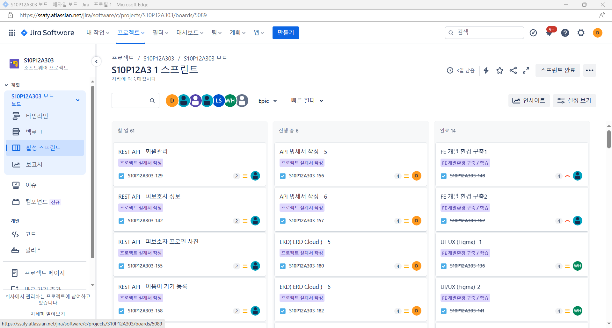

# 1. 스크럼 회의 진행

오늘 이제 Jira 스프린트 시작하고, 오늘 회의 있으니까 전부 ERD랑 API 명세서(PostMan) 보면서
보완할 점 보완하고 전부 숙지하자.

  

# 2. ERD, API 명세서 수정

ERD 수정

API 명세서 수정
https://lunar-resonance-758778.postman.co/workspace/My-Workspace~a713585f-a92b-4643-86d3-96d6262dd618/folder/14490463-06d41ba0-d252-4be6-9498-e3ff3a8392a5

 

# 3. Jira 헛수고...

# 4. Jira 스프린트 완성

# 회고
하... Jira 처음 해봐서 어떻게 하는지 몰라서 너무 시간 낭비를 많이 했다.

점심에 병원 다녀오고나서 본격적으로 시작했는데

작업(이슈) 당 4포인트 이상씩 할당하면 안된다는 것도 몰랐고, 스토리도 요구사항인줄 알았는데 각 팀당 하기 나름이였고,
이래저래 혼란스러운 하루였다.
코치님에게 물어보고 팀에게 공유하고 오늘 김보경 코치님이랑 2학기 시작하고 가장 많이 대화를 나눈 것 같다...
바쁘신데 자꾸 잡은 것 같아서 좀 죄송스럽긴하다.

내일은 좀 여유로운 하루가 됐으면 좋겠다.
그래도 하루하루 시간이 빨리 지나는 걸 보니 보람차고 잘 보내고 있는 것 같다.
