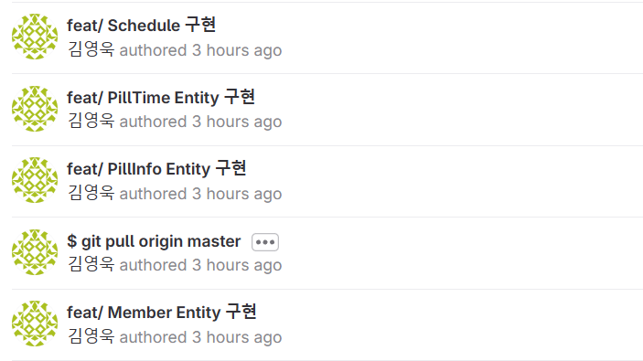
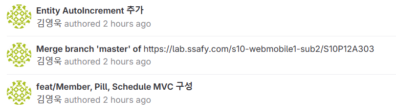

# 1. 스크럼 회의 진행

우리 React에서 Vue3로 바꾸자. 전공자들이 React를 모르니까 도와줄 수가 없다.

오늘 오전에는 서로 이제 개발환경 맞추자.

오늘 오후에 프론트들은 Vue3 공부하면서 Figma 다시 고치고, 백엔드는 기본적인 MVC패턴 구현하고, API 명세서 수정하고,
다찬, 성목은 오늘 일정이랑 시간 나면 도와주는 식으로 진행하자.

  

# 2. MVC패턴 구현, API 명세서 수정(사진생략)

MVC1

MVC2

 

# 3. 회고

오늘 본격적으로 개발 들어가서 그런지 뭔가 많이 진행된거 같아서 뿌듯하다.
MVC 패턴 구조까지는 전부 했고, API 명세서 formData, JSON차이도 확실히 알게 돼서 좋았다.
