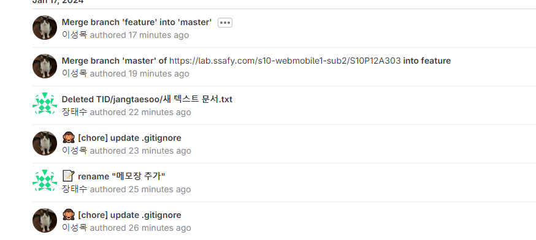

# 2024-01-18

## 라즈베리파이 초기 설정
- 라즈비안 OS 설치
- 카메라 모듈 작동 확인
- 할당받은 고정 IP 설정
- 라즈베리파이 원격 연결 설정

## 느낀 점
- 설정을 빠르게 끝낼 수 있을 거라고 생각했는데 자료가 맞지 않는 게 많아서 하루 종일 걸렸다. 너무 힘들었다

# 2024-01-17

## Git 프로젝트 설정

### .gitignore 추가

### API 명세서 수정
- 맞지 않는 HTTP Method 사용한 API 수정
- 반환 값이 다른 API 수정
---
 
 
 
 
 
 
 

# 2024-01-16

## ERDCloud 사용해서 ERD 작성

## Postman 사용해서 API 명세서 작성

