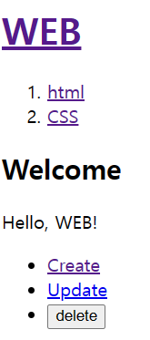

## 2024.01.16
오늘은 next js의 프로젝트 생성 방법 및 샘플 앱을 세탁하는 절차를 알아봤다.
또한, 구조를 파악하면서 해당 코드가 어떻게 넘겨지는지 팀원과의 소통을 통해 서로 자기가 학습한 내용을 교류하였다.
해당 사진은 오늘 작업한 내용이다.

다음과 같이 메인화면을 제작하고, 해당 a태그를 클릭하면 해당 링크로 넘어갈 수 있도록 루트 레이아웃을 작성하고, 각각의 링크의 레이아웃이 어떻게 작동하는지 추측하며 학습하였다.

위의 사진과 같이 create를 누르면, 내용이 변환함과 링크가 변환됨을 알 수 있다.