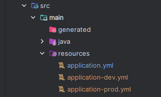

# 환경 변수

## application.yml

```java
logging:
  level:
    org.springframework.web.client: debug
    org.hibernate.sql: debug
    org.hibernate.type: trace
    org.springframework.security: debug

server:
  servlet:
    encoding:
      charset: UTF-8
      force: true

spring:
  profiles:
    default: dev
```

## application-dev.yml

```java
openai:
  model: gpt-4
  secret-key: { secret-key }

naver-cloud-sms:
  accessKey: { access-key }
  secretKey: { secret-key }
  serviceId: ncp:sms:kr:306358610173:shopping_m
  senderPhone: { phone-number }

naver-cloud-stt:
  secret: { secret-key }
  id: { naver-cloud-id }

cloud:
  aws:
    s3:
      bucket: ieumbucket
    stack.auto: false
    region.static: ap-northeast-2
    credentials:
      accessKey: { access-key }
      secretKey: { secret-key }

spring:
  jpa:
    database-platform: org.hibernate.dialect.MySQL8Dialect
    hibernate:
      ddl-auto: validate
    properties:
      hibernate:
        auto_quote_keyword: true
        format_sql: true
        show_sql: true
      defer-datasource-initialization: true
      sql:
        init:
          mode: always

  servlet:
    multipart:
      max-file-size: 10MB
      max-request-size: 20MB

  datasource:
    driver-class-name: com.mysql.cj.jdbc.Driver
    url: jdbc:mysql://ieum-db.c96ewwk82957.ap-northeast-2.rds.amazonaws.com:3306/IEUM_DEV?useSSL=false&useUnicode=true&characterEncoding=utf8&serverTimezone=Asia/Seoul
    username: { username }
    password: { password }

    # 커넥션 풀
    hikari:
      maximum-pool-size: 10
      connection-timeout: 5000
      connection-init-sql: SELECT 1
      validation-timeout: 2000
      minimum-idle: 10
      idle-timeout: 600000
      max-lifetime: 1800000
  data:
    redis:
      host: i10a303.p.ssafy.io
      port: 6379
      host2: i10a303.p.ssafy.io
      port2: 6379

# jwt
jwt:
  secret-key: { secret-key }
  expiration: 86400000
  refresh:
    expiration: 604800000

server:
  ssl:
    enabled: true
    key-store: classpath:AN-keystore.p12
    key-store-type: PKCS12
    key-alias: ieumsecurity
    key-store-password: { key-store-password }
  port: 8080

openvidu:
  url: https://i10a303.p.ssafy.io:4443/
  secret: MY_SECRET
```

---

## application-prod.yml

```java
openai:
  model: gpt-3.5-turbo
  secret-key: { secret-key }

naver-cloud-sms:
  accessKey: { access-key }
  secretKey: { secret-key }
  serviceId: ncp:sms:kr:306358610173:shopping_m
  senderPhone: { phone-number }

naver-cloud-stt:
  secret: { secret-key }
  id: { naver-cloud-id }

spring:
  jpa:
    database-platform: org.hibernate.dialect.MySQL8Dialect
    hibernate:
      ddl-auto: validate
  properties:
    hibernate:
      auto_quote_keyword: true
      format_sql: true
      show_sql: true
  defer-datasource-initialization: true
  sql:
    init:
      mode: always

  servlet:
    multipart:
      max-file-size: 10MB
      max-request-size: 20MB

  datasource:
    driver-class-name: com.mysql.cj.jdbc.Driver
    url: jdbc:mysql://ieum-db.c96ewwk82957.ap-northeast-2.rds.amazonaws.com:3306/IEUM_PROD?useSSL=false&useUnicode=true&characterEncoding=utf8&serverTimezone=Asia/Seoul
    username: { username }
    password: { password }

    # 커넥션 풀
    hikari:
      maximum-pool-size: 10
      connection-timeout: 5000
      connection-init-sql: SELECT 1
      validation-timeout: 2000
      minimum-idle: 10
      idle-timeout: 600000
      max-lifetime: 1800000

	data:
    redis:
      host: 54.180.108.118
      port: 6379

#jwt
jwt:
  secret-key: { secret-key }
  expiration: 86400000
  refresh:
    expiration: 604800000
```


